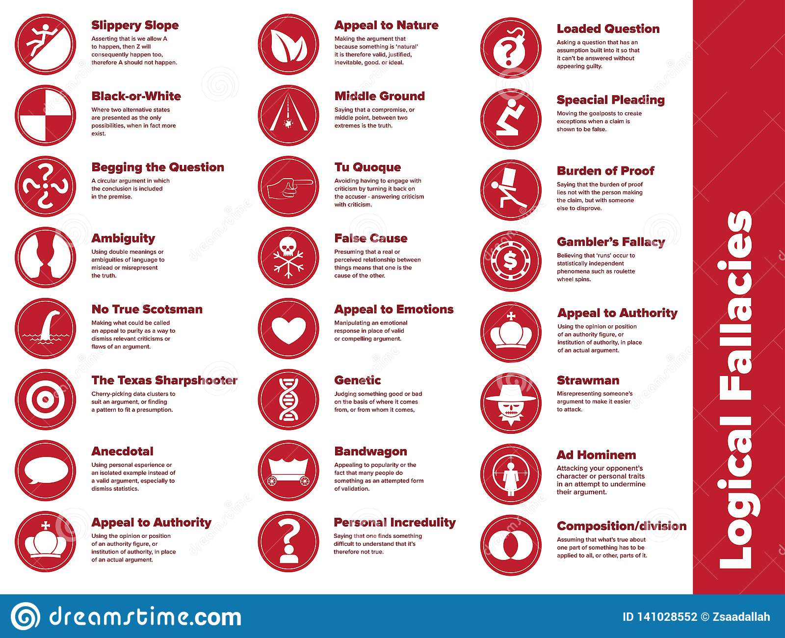

# Day 3

Breakdown of all key areas in Day 3

## Critical Thinking

- Helps to create a strong argument by justifying claims with evidence gathered and evaluated
- Contributes to any role as it requires ability to gather, analyse and evaluate information

### Skills

- Actively listen to all sides of the argument
- Checking facts and evidence
- Responding objectively

### Thinking Triangle

[Benjamin Blooms](https://tips.uark.edu/using-blooms-taxonomy/)

- **Evaluate** = Make Judgements about ideas and information
- **Synthesise** = Combine information into something new
- **Analyse** = Make a methodical and detailed examination
- **Apply** = Use knowledge
- **Understand** = Have understanding
- **Remember** = Be aware of something and recall that information

### Process

- _Identify_
  - The main points of the argument
  - The claims being made
  - The evidence used
  - The conclusions reached

- _Analyse_
  - Does the information make sense in relation to other research?
  - How old is the material?
  - Is the material clear of do you need to find additional information to aid understanding?
  - Does the argument present a abalanced view or are some topics disregarded?

- _Apply and Compare_
  - The implications of other information
  - Weaknesses when applied to a real-life situation
  - A lack of coverage

### 3 Models of Thinking

- **Divergent** (Imagination) = Questions and ideas
- **Convergent** (Logic) = Answers and facts
- **Lateral** (Uses both Divergent and Convergent)

### Incorrect Attitudes

- **_Ignorant Certainty_**
  - The belief that there are definite answers to all questions

- **_Naive realtivism_**
  - The belief that there is no truth and all arguments are equal

Neither of these ways of thinking are correct and will prevent you from ebracing critical thinking with an open and objective mind.

## Enquiry-Based Learning

It's about asking and enquiring informations before making a judgement.
Asking all sides for input and asking further questions to gain more information.
After which making the judgement.

### Enquiry Cycle

_What kind of questions might we ask when thinking critically?_

#### Things to consider

- What is the source of evidence?
- What are the kind of claims being made?
- Where is the evidence for these claims?
- What are the Strengths and Weaknesses?
- How clear are the points?
- Is it a balanced argument?
- Are there underlying themes?
- Do we understand the background?
- Are the examples good?
- Are the examples real or imagined?
- Do we have enough evidence?
- Is there causalties?

CHECK WITH RECORDING ^

## What is an argument

- **_Claim_**
  - Present your argument in a clear statement
- **_Evidence_**
  - Present evidence to support your claim
- **_Impact_**
  - Explain the significance of the evidence

- **Coherence**
  - _Consider the following:_
    - Do the claims make logical sense?
    - Are the claims based on opinion or supported with evidence?
    - Are any assumptions made?
    - Have all alternatives been considered?

- **Supporting Evidence**
  - _Consider the following:_
    - Does the evidence suport all claims made?
    - Is the evidence appropriate for the topic?
    - Is the evidence recent?
    - Does the evidence conflict or completent other evidence?
    - Where does the evidence come from

Quality of evidence = Quality of Data + Quality of Interpretation

### Logical Fallacies

- **_False Dichotomoy_**
  - Where the speaker forces the debate into two sides, though there are more options available
- **_Assertion_**
  - When the speaker presenta a statement as fact which appears invalid or may be an assumption
- **_Morally Flawed_**
  - Arguments which go against the code of ethics and morals
- **_Correlation rather than causation_**
  - When a speaker suggests a link between two events suggesting one lead to the other but
without sufficient evidence
- **_Failure to deliver promises_**
  - A speaker might fail to complete a task they promised to deliver, such as evidence they promised to provide
- **_Straw man_**
  - The speaker may intentionally introduce an argument against them and rebut it to strenghthen their position
- **_Contradiction_**
  - A speaker's argument may contracit their previous argument and reduce their credibility
- **_Compare the conclusion to reality_**
  - Consider what would happen if the motion became reality, which usually reveals that it's more complicated and problematic than the speaker suggested

## Art of Persuasion

### The Three Pillars of Rhetoric

- **_Ethos_** = Authority or credibility
- **_Pathos_** = Emotional empathy
- **_Logos_** = Logic and reasoning

#### Important Skills for Debating

- Keep points relevant
- Provide evidence and not personal opinion
- Remain objective
- Consider the audience's attention span
- Use notes but keep them brief and well organised

#### Do

- Be prepared
- Stay calm
- Speak clearly and confidently
- Keep your language simple
- Active Listening

#### Don't

- Falsify or alter evidence
- Publicly disagree with the decision
- Attack a speaker rather than the motion
- Act aggressively or offensively
- Interrupt others
- Disagree with facts or obvious truths

#### Remember

- It's OK to make mistakes
- It's OK to agree
