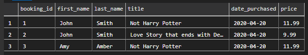
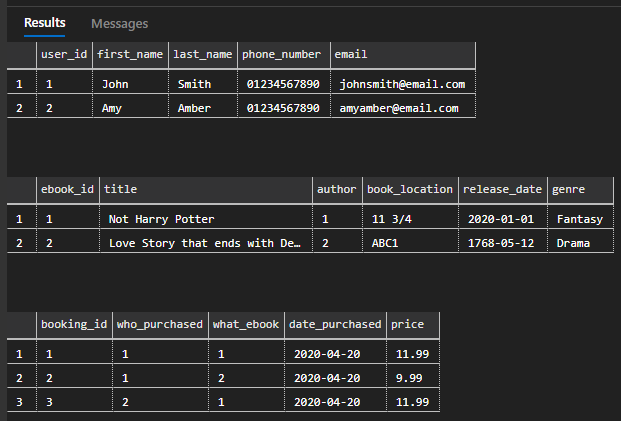

# Explanation

First create database.

```sql
CREATE DATABASE bookstore;
```

Then create tables for the data interpretation.

```sql
USE bookstore;

CREATE TABLE users (
    user_id INT NOT NULL IDENTITY(1,1) PRIMARY KEY,
    first_name VARCHAR(255) NOT NULL,
    last_name VARCHAR(255) NOT NULL,
    phone_number VARCHAR(11) NOT NULL,
    email VARCHAR(255) NOT NULL
);

CREATE TABLE authors (
    author_id INT NOT NULL IDENTITY(1,1) PRIMARY KEY,
    first_name_author VARCHAR(255) NOT NULL,
    last_name_author VARCHAR(255) NOT NULL,
    bio VARCHAR(max) DEFAULT NULL
)

CREATE TABLE ebooks (
    ebook_id INT NOT NULL IDENTITY(1,1) PRIMARY KEY,
    title VARCHAR(255) NOT NULL,
    author INT REFERENCES authors(author_id),
    book_location VARCHAR(6) NOT NULL,
    release_date DATE NOT NULL,
    genre VARCHAR(255) NOT NULL
);

CREATE TABLE booking (
    booking_id INT NOT NULL IDENTITY(1,1) PRIMARY KEY,
    who_purchased INT REFERENCES users(user_id),
    what_ebook INT REFERENCES ebooks(ebook_id),
    date_purchased DATE,
    price DECIMAL(5,2)
);
```

- We need to test our database and tables, to check that the structure is correct.
- For that we will input some sample data that will be used as a debug test.

```sql
USE bookstore;

INSERT INTO users (
    first_name,
    last_name,
    phone_number,
    email
) VALUES (
    'John',
    'Smith',
    '01234567890',
    'johnsmith@email.com'
);

INSERT INTO users (
    first_name,
    last_name,
    phone_number,
    email
) VALUES (
    'Amy',
    'Amber',
    '01234567890',
    'amyamber@email.com'
);

INSERT INTO authors (
    first_name_author,
    last_name_author,
    bio
) VALUES (
    'J.K.',
    'Rowling',
    'Loves Harry Potter books'
);

INSERT INTO authors (
    first_name_author,
    last_name_author
) VALUES (
    'William',
    'Shakespeare'
);

INSERT INTO ebooks (
    title,
    author,
    book_location,
    release_date,
    genre
) VALUES (
    'Not Harry Potter',
    1,
    '11 3/4',
    '20200101',
    'Fantasy'
);

INSERT INTO ebooks (
    title,
    author,
    book_location,
    release_date,
    genre
) VALUES (
    'Love Story that ends with Death',
    2,
    'ABC1',
    '17680512',
    'Drama'
);

INSERT INTO booking (
    who_purchased,
    what_ebook,
    date_purchased,
    price
) VALUES (
    1,
    1,
    '20200420',
    11.99
);

INSERT INTO booking (
    who_purchased,
    what_ebook,
    date_purchased,
    price
) VALUES (
    1,
    2,
    '20200420',
    9.99
);

INSERT INTO booking (
    who_purchased,
    what_ebook,
    date_purchased,
    price
) VALUES (
    2,
    1,
    '20200420',
    11.99
);
```

To test that our data works we need to then make an output request (SELECT).
We can simply run `SELECT * FROM` and use each table one by one to see the results but we can also just use `INNER JOIN`.

```sql
USE bookstore;

SELECT
    booking.booking_id,
    users.first_name,
    users.last_name,
    ebooks.title,
    booking.date_purchased,
    booking.price
FROM booking
INNER JOIN users ON booking.who_purchased = users.user_id
INNER JOIN ebooks ON booking.what_ebook = ebooks.ebook_id;
```

This way our output is formatted and it displays data based on other tables that match our `booking` table. Results:



## Simple output

We can just use the following for simple output.

```sql
SELECT * FROM users;
SELECT * FROM authors;
SELECT * FROM ebooks;
SELECT * FROM booking;
```

This will return the following results:

