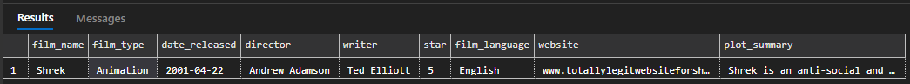

# Explanation

First we create a database.

```sql
CREATE DATABASE film_database;
```

Then we create a new table that will be used to hold all of our film information.

```sql
USE film_database;

CREATE TABLE films (
    film_name VARCHAR(168),
    film_type VARCHAR(15),
    date_released DATE,
    director VARCHAR(20),
    writer VARCHAR(20),
    star VARCHAR(20),
    film_language VARCHAR(20),
    website VARCHAR(max),
    plot_summary VARCHAR(max)
);
```

Next, we need to populate the table with some information.

```sql
USE film_database;

INSERT INTO films (
    film_name,
    film_type,
    date_released,
    director,
    writer,
    star,
    film_language,
    website,
    plot_summary
) VALUES (
    'Shrek',
    'Animation',
    '20010422',
    'Andrew Adamson',
    'Ted Elliott',
    'Eddie Murphy',
    'English',
    'www.totallylegitwebsiteforshrek.com',
    'Shrek is an anti-social and highly-territorial green ogre who loves the solitude of his swamp. His life is interrupted after the dwarfish Lord Farquaad of Duloc exiles a countless number of fairy-tale creatures to Shrek''s swamp. Angered by the intrusion, he decides to pay Farquaad a visit and demand they be moved elsewhere. He reluctantly allows the talkative Donkey, who was exiled as well, to tag along and guide him to Duloc.'
);
```

After populating we might want to change the `star` column to be a `star` rating instead of main starring actor.

```sql
USE film_database;

UPDATE films
    SET star = NULL
```

Now with the new data we can attempt to change the type of data our column takes with the following.

```sql
USE film_database;

ALTER TABLE films
    ALTER COLUMN star INT
```

Or as a nested query.

```sql
USE film_database;

UPDATE films
    SET star = NULL
        ALTER TABLE group_1
            ALTER COLUMN star INT;
```

We can then view all of our data.

```sql
USE film_database;

SELECT * FROM films;
```

Final output:

